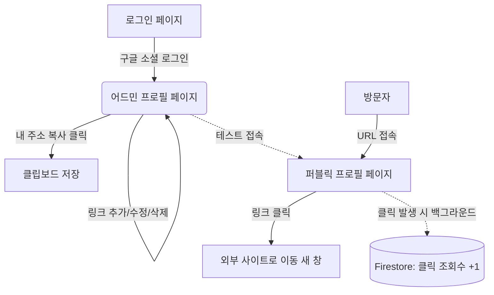

# 마이링크(MyLink) 화면 설계서 (Wireframe)

## 1. 전체 화면 흐름도 (Screen Flow)
서비스의 전체적인 페이지 이동 흐름과 백그라운드 데이터 처리 구조입니다.



---

## 2. 화면별 와이어프레임 (ASCII Art)

### 2.1. 로그인 페이지 (Login Screen)
- **대상**: 전체 (주로 신규 가입자 및 기존 소유자)
- **설명**: 복잡한 회원가입 절차 없이 오직 구글 소셜 로그인만 제공하는 심플한 진입 화면입니다.

```text
+-------------------------------------------------+
|                                                 |
|                                                 |
|                                                 |
|                  [ MyLink ]                     |
|                                                 |
|        당신의 모든 링크를 하나로 모으세요       |
|                                                 |
|                                                 |
|                                                 |
|          +---------------------------+          |
|          | (G) Continue with Google  |          |
|          +---------------------------+          |
|                                                 |
|                                                 |
|                                                 |
|                                                 |
|                                                 |
+-------------------------------------------------+
```

---

### 2.2. 어드민 페이지 (Admin / Owner Screen)
- **대상**: 링크 소유자 (가입 완료자)
- **설명**: 모바일 뷰어와 편집기가 결합된 단일 세로형 화면입니다. 텍스트를 클릭해 제자리에서 인라인 편집을 수행하며, 우측 하단의 플로팅 버튼(FAB)으로 쉽게 링크를 추가할 수 있습니다.

```text
+-------------------------------------------------+
| [고정 헤더] mylink.com/displayName   [주소 복사]|
+-------------------------------------------------+
|                                                 |
|   +-----------------------------------------+   |
|   | (디스플레이 이름)  [인라인 편집 가능]   |   |
|   | displayName                             |   |
|   |                                         |   |
|   | (소개글 - Bio)     [인라인 편집 가능]   |   |
|   | 안녕하세요, 개발자 displayName입니다.   |   |
|   +-----------------------------------------+   |
|                                                 |
|   [ 등록된 링크 목록 ]                          |
|                                                 |
|   +-----------------------------------------+   |
|   | (G) | [타이틀 인라인 편집] GitHub       | X |
|   |     | [URL 인라인 편집] github.com/..   |   |
|   |     |                          (조회:12)|   |
|   +-----------------------------------------+   |
|                                                 |
|   +-----------------------------------------+   |
|   | (N) | [타이틀 인라인 편집] 기술 블로그  | X |
|   |     | [URL 인라인 편집] blog.naver...   |   |
|   |     |                         (조회:140)|   |
|   +-----------------------------------------+   |
|                                                 |
|                                                 |
|                                          ( + )  | <-- [플로팅 버튼: 새 링크 추가]
+-------------------------------------------------+
* (G), (N) 등은 Google Favicon API를 통해 불러온 파비콘 영역입니다.
* 'X' 버튼을 누르면 삭제 확인 모달창이 나타납니다.
```

---

### 2.3. 퍼블릭 프로필 페이지 (Public Screen)
- **대상**: URL을 통해 접속한 모든 방문자 (Visitor)
- **설명**: 소유자가 설정한 `displayName`과 등록한 링크들만 깔끔하게 보여주는 노출 전용 페이지입니다. 복잡한 테마 커스텀 없이 미니멀하고 직관적인 UI를 제공합니다.

```text
+-------------------------------------------------+
|                                                 |
|                                                 |
|             [ displayName ]                     |
|                                                 |
|       안녕하세요, 개발자 displayName입니다.     |
|                                                 |
|                                                 |
|   +-----------------------------------------+   |
|   |                                         |   |
|   |  (G)            GitHub                  |   |
|   |                                         |   |
|   +-----------------------------------------+   |
|                                                 |
|   +-----------------------------------------+   |
|   |                                         |   |
|   |  (N)          기술 블로그               |   |
|   |                                         |   |
|   +-----------------------------------------+   |
|                                                 |
|                                                 |
|                                                 |
|             Powered by MyLink                   |
+-------------------------------------------------+
```

---

## 3. UI/UX 주요 정책 요약
1. **인라인 편집 (Inline Edit)**: 어드민 페이지에서 `displayName`, `Bio`, 링크 타이틀, 링크 URL 부분은 일반 텍스트처럼 보이지만, 클릭하는 순간 텍스트 입력창(`input`)으로 전환됩니다. 포커스를 잃거나(Blur) 엔터를 치면 즉시 자동 저장됩니다.
2. **파비콘 API 활용**: 링크 등록 즉시 구글 파비콘 API(`https://s2.googleusercontent.com/s2/favicons?domain=...`)를 호출하여, 좌측 아이콘 자리에 썸네일로 렌더링합니다.
3. **고정형(Floating) 액션 버튼**: 언제든지 빠르게 링크를 추가할 수 있도록 새 링크 추가 버튼(+)을 우측 하단에 고정(`position: fixed`) 시켰습니다.
4. **URL 접근성 최적화**: 내 프로필 주소를 상단 헤더에 고정시켜 두어, 어드민 작업 중 언제든 한 번의 클릭으로 홍보용 URL을 복사할 수 있습니다.
